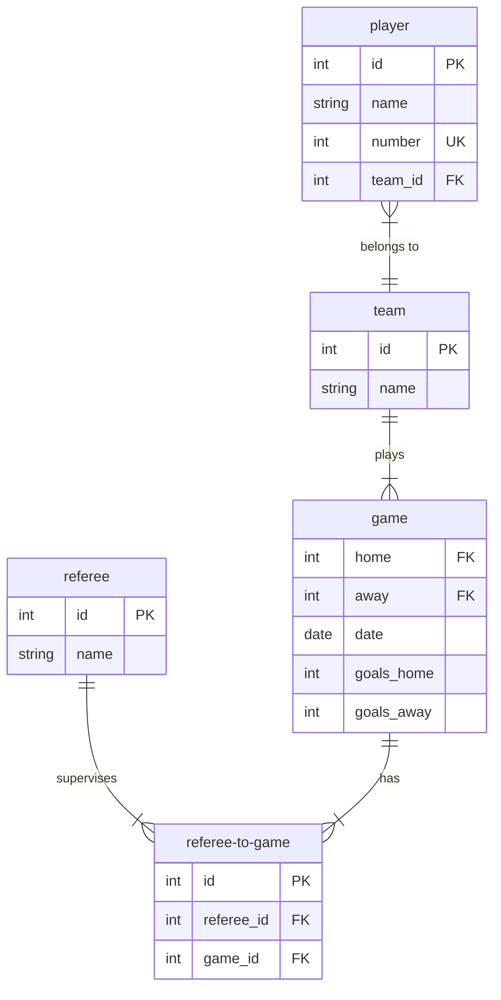

```mermaid
erDiagram
	player {
		int id PK
		string name
		int number UK
		int team_id FK
	}
	team {
		int id PK
		string name
	}
	referee {
		int id PK
		string name
	}
	referee-to-game {
		int id PK
		int referee_id FK
		int game_id FK
	}
	game {
		int home FK
		int away FK
		date date
		int goals_home
		int goals_away
	}

	player }|--|| team: "belongs to"
	referee ||--|{ referee-to-game: "supervises"
	game ||--|{ referee-to-game: "has"
	team ||--|{ game :"plays"
```
