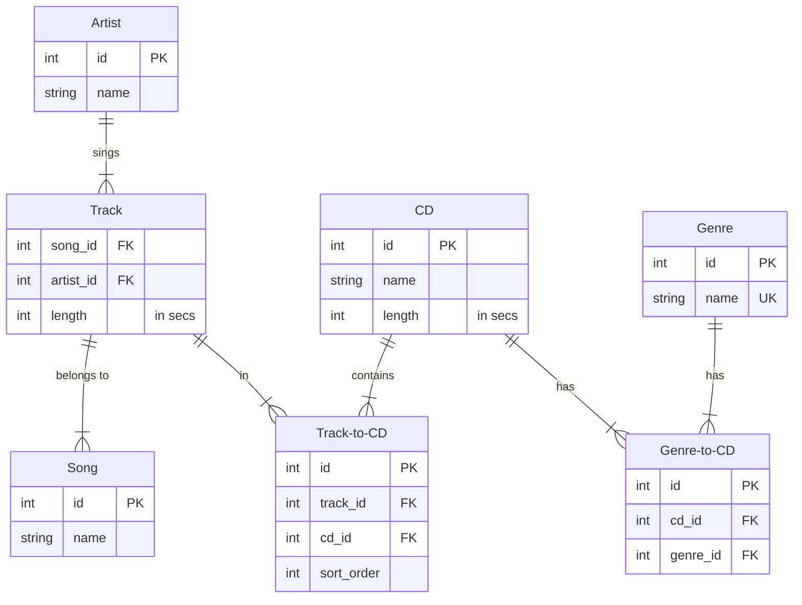

# CD Verwaltung

## 1

## 2

### Song
#### Schlüsselkandidaten
- id
- name
#### Primärschlüssel
id
#### Fremdschlüssel
keiner
### Artist
#### Schlüsselkandidaten
- id
- name
#### Primärschlüssel
id
#### Fremdschlüssel
keiner
### CD
#### Schlüsselkandidaten
- id
- name
#### Primärschlüssel
- id
#### Fremdschlüssel
keiner
### Genre
#### Schlüsselkandidaten
- id
- name
#### Primärschlüssel
id
#### Fremdschlüssel
keiner
### Song-to-CD
#### Schlüsselkandidaten
- id
- song_id, cd_id
#### Primärschlüssel
id
#### Fremdschlüssel
- song_id
- cd_id
### Song-to-Artist
#### Schlüsselkandidaten
- id
- song_id, artist_id
#### Primärschlüssel
id
#### Fremdschlüssel
- song_id
- artist_id
### Genre-to-CD
#### Schlüsselkandidaten
- id
- genre_id, cd_id
#### Primärschlüssel
id
#### Fremdschlüssel
- genre_id
- cd_id

## 3

- length der cd (kann berechnet werden)
